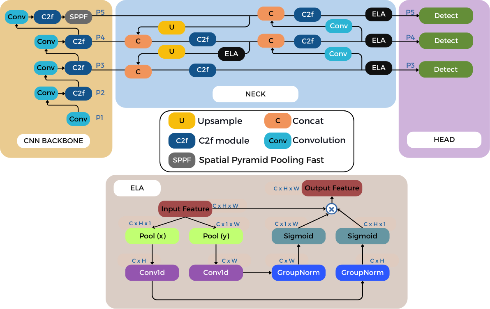
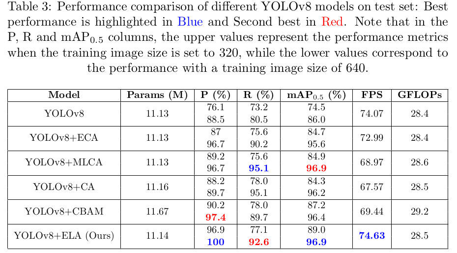

# YOLO-ELA: Efficient Local Attention Modeling for High-Performance Real-Time Insulator Defect Detection

## Architecture


## Requirements
Install requirements
```shell
pip install -r requirements.txt
```
+ +NVIDIA GPU + CUDA CuDNN
+ +Linux (Ubuntu)
+ +Python 3.10

 
## Get the test results
Open a terminal and run
```shell
python test.py\
        --model 'models/yolo_ela.pt'\ 
       
```
This automatically create a new directory called `run`. Navigate to see results



## How to train YOLO-ELA on your dataset
Open terminal and run
```shell
python train.py \
        --model_scale 'ela' \
        --cfg 'data/sa.yaml' \
        --aug True \
        --name 'ela' \
        --epochs 100 \
        --bs 16 \
        --img_sz 640 # Image size can either be 320 or 640

```
## Credit
The codes in this repository are based on [Ultralytics](https://github.com/ultralytics/ultralytics)

